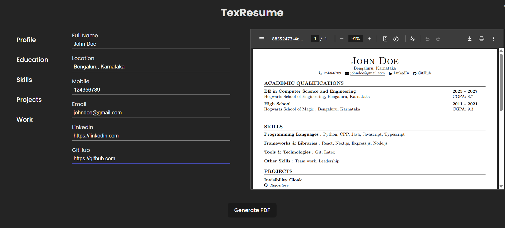

# TexResume
TexResume is a web-based resume builder designed specifically for tech students and professionals. It allows users to create structured, professional LaTeX resumes by filling out a form. The LaTeX code is generated dynamically, and a real-time PDF preview is compiled using SwiftLaTeX in WebAssembly (WASM).

Tech Stack - 

Frontend: React + Vite

LaTeX Compilation: SwiftLaTeX (WASM)

The LaTex template used in this project is a slightly modified version of [this template](https://www.overleaf.com/latex/templates/jakes-resume-anonymous/cstpnrbkhndn)

🚧 Under Maintenance 

This project uses SwiftLaTeX to compile LaTeX in the browser. However, as of July 3, 2025, the [SwiftLaTeX CDN ](https://texlive2.swiftlatex.com) is down (Error 522 - Connection timed out), which prevents the engine from loading required files like swiftlatexpdftex.fmt.

I'm currently working on a fix or workaround to restore functionality.